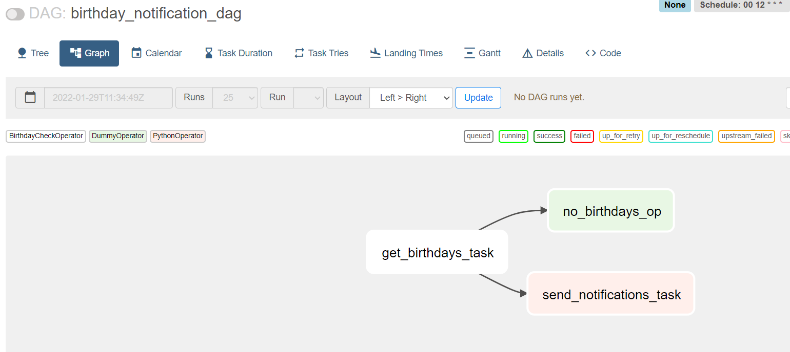

# Planner

## Описание

Реализована отправка в очередь по средством airflow сообщений о днях рождениях

### Endpoints

`http://{ip-address}:8080/home` - веб-интерфейс airflow, user:bitnami


### Запуск

Запуск :

```bash
docker-compose up
```

`http://{ip-address}:8080/home` - веб-интерфейс airflow, user:bitnami
```

### Описание работы

Написаны следующие операторы

1. BirthdayCheckOperator - проверяет наличие именниников

2. NotificationSender - отправляет в очередь RabbitMQ

### Схема работы 



